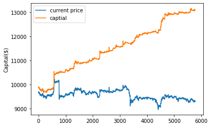
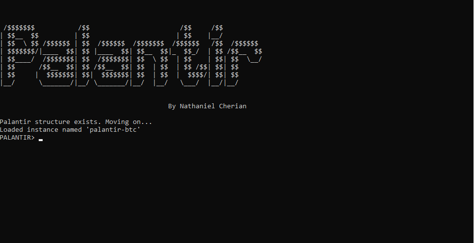

# 

[](https://badge.fury.io/py/palantir-cli)
[](https://github.com/psf/black)
[](https://travis-ci.org/nathanielCherian/palantir)
[](https://www.repostatus.org/#wip)


The Palantir Project is an attempt to aggregate and take advantage of the patterns of tradable assets in the context of [auto-correlation](https://en.wikipedia.org/wiki/Autocorrelation). Palantir exploits the [efficiency](https://en.wikipedia.org/wiki/Efficient-market_hypothesis) of the market in the market to try make a long or short prediction As if now Palantir has been optimized soley for bitcoin (for its high volatility) but will soon expand into all aspects of trade. 

## Background

At it's core palantir combines techinal indicators from different time periods and settings to form predictions about markets in the near-future. Then the optimal decisions are made to maximize profit. 




The preceding chart shows a simulation of a model trained on data from 2020-06-01 to 2020-06-20 and actively playing on unseen data from 2020-06-21 to 2020-06-30 with 1 bitcoin and 200USD. Based on it's predictions palantir shorts or holds to maintain constant profit-growth.


## Installation

```pip install palantir-cli```

or for the latest dev version...

```pip install git+git:https://github.com/nathanielCherian/palantir.git```


## Usage

Palantir's CLI interface can be activated from terminal with

```$ palantir```

Palantir will look for special identification files in the current directory before it loads the software. If these files do not exist or are not correct palantir will create them.



### Quick commands (within palantir)

Arguments with a * are positional required args while ones with ** are optional
and must be entered in the form ```foo=bar```. (similar to *args and **kwargs in python)

``` 
PALANTIR> help
PALANTIR> get-btc *[directory:str] **[days:50]
PALANTIR> init *[data-directory:str]
PALANTIR> backtest *[data-directory:str] **[save:str] **[fee:0.001] **[cash:400] **[bitcoin:1]

PALANTIR> rename *[new_name:str]
PALANTIR> exit
PALANTIR> clear
```


## Issues

Palantir is still a WORK IN PROGRESS and will need more work before it has become a useful tool

* ~~Bitcoin trading fees: After applying the maximum fee (.30% per transaction) to trades the basic machine suffers greatly. To counteract this we have to find the equilibrium between minimizing trades and maximizing profits. Note: This will not be a problem in the palantir-stocks~~

* Need to work on the CLI 

Please report any issues [here](https://github.com/nathanielCherian/palantir/issues). Thanks!

## Contributing

All contributions are very welcome.